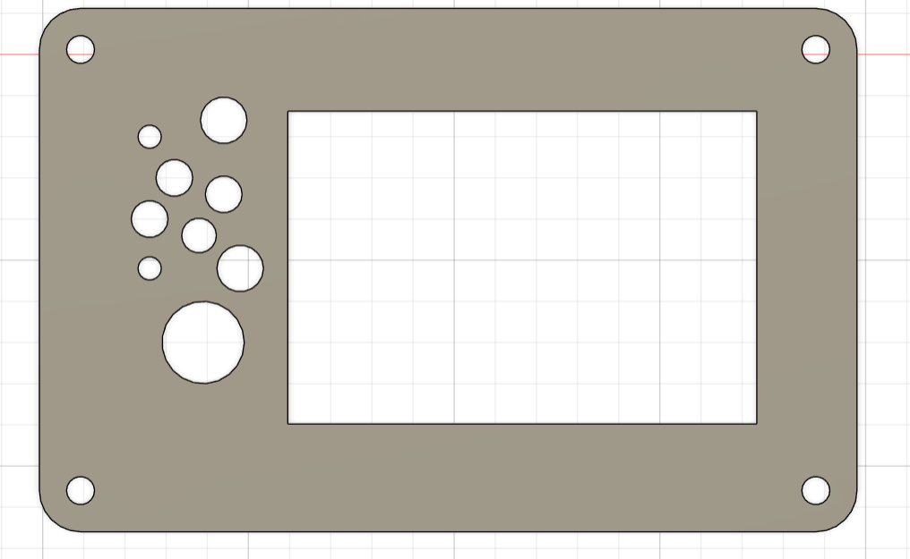
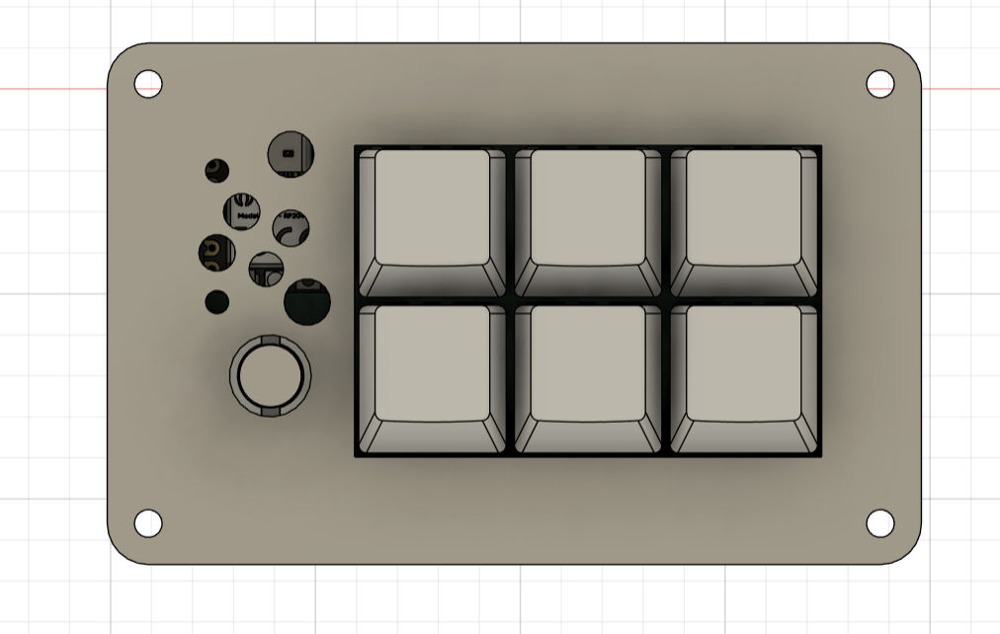

# 🍊 FantaPad
my surname is Fanta so i started thinking about the name of the name for the pad and for some reason I chose FantaPad i think its kinda funny 

now let get to the Features of the FantaPad
#Features
it have 6x buttons 1x rotary encoder with push button 
The 6x bottons are for shortcuts like copy,paste,cut,delet and so on
The rotary encoder is for volume and if you press it, it change layer
Layer 1: volume
layer 2: Zoom
layer 3: Scrub mode
The pad feature a RGB lighting

PCB Design:
The PCB was designed in KiCad

Here is the Schematic Picture for the Pad

I will also put images of the 3D print files here:
Here is the down part:

Here is the top part:

FantaPad Completed image:

Tutorial how to download the python to the board
1. Install CircuitPython:
   Hold the `BOOT` button on the XIAO RP2040, plug it into your PC, and copy the `.uf2` file to the `RPI-RP2` drive.

2. Install KMK:
   Download the KMK Firmware (https://github.com/KMKfw/kmk_firmware) and copy the `kmk` folder to the `lib` folder on your `CIRCUITPY` drive.

3. Upload Code:
   Copy the provided `code.py` to the root of the `CIRCUITPY` drive.

